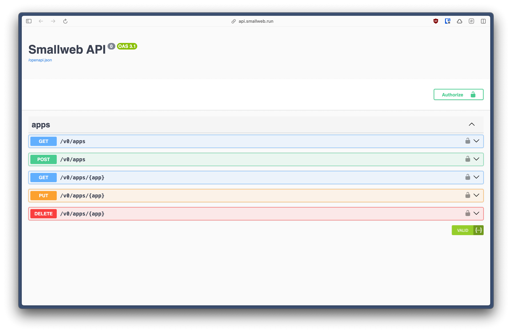

# Smallweb API

A rest API for your internet folder.



## Usage

```ts
// ~/smallweb/api/main.ts
import { SmallwebApi } from "./src/mod.ts";

const api = new SmallwebApi();

export default api;
```

```json
// ~/smallweb/api/smallweb.json
{
    "admin": true
}
```

```sh
# ~/smallweb/api/.env
SMALLWEB_API_TOKEN=my-secret-token
```
