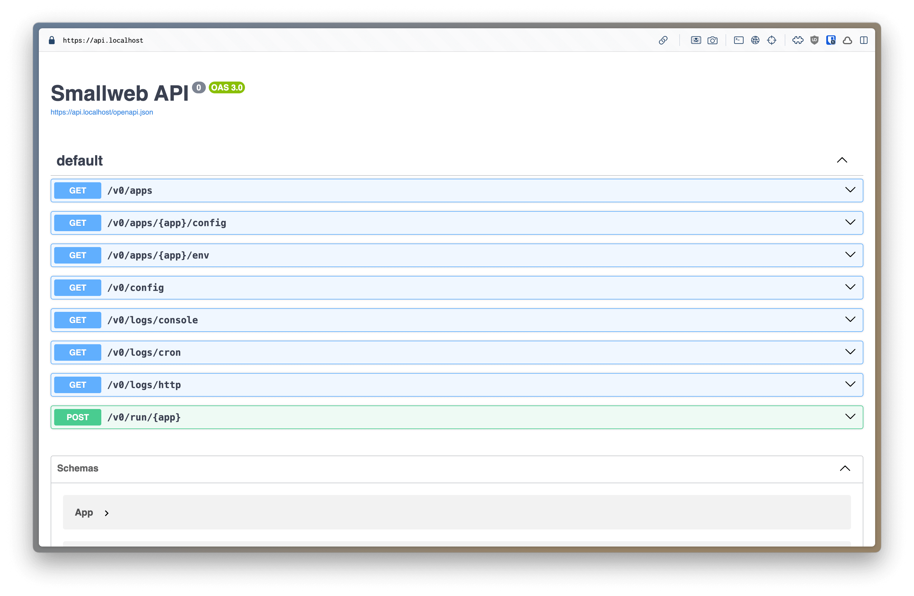

Smallweb `0.14` is the first release approaching the vision I had for the project when I started it.

It includes a lot of new features, but almost no breaking changes, which is a good sign that the project is maturing.

<!-- more -->

You can upgrade to the latest version using:

```sh
smallweb version upgrade 0.14.0
```

Or if you are new to smallweb, you can install it using:

```sh
curl -sSfL https://install.smallweb.run | sh
```

## Admin / REST API

You can now manage your apps using a new REST API.

You'll need to assign a subdomain to it:

```json
// ~/smallweb/api/smallweb.json
{
    "entrypoint": "smallweb:api",
    "private": true,
    "publicRoutes": [
        "/openapi.json",
        "/schemas/app.schema.json",
        "/schemas/config.schema.json",
    ]
}
```

Note that:

- There is a new kind of entrypoint, with a `smallweb:` specifier.
- We protect the API with the `private` flag.
- We expose some key routes to the public, like the OpenAPI schema.



Currently the API includes a limited set of endpoints, but it will be expanded in the future.

There are also some endpoints which are not documented in the OpenAPI schema:

- a `/webdav` endpoint to manage your files using WebDAV (this replaces `https://webdav.<your-domain>`)
- json schemas for app and global config (`/schemas/app.schema.json` and `/schemas/config.schema.json`)

Of course, it's quite easy to generate a client for the API using the OpenAPI schema. I recommend using [fets](https://the-guild.dev/openapi/fets/client/quick-start), as it does not require any code generation.

```ts
import { createClient, type NormalizeOAS } from 'npm:fets'
import type openapi from 'jsr:@smallweb/openapi@0.14.0'

const client = createClient<NormalizeOAS<typeof openapi>>({
    endpoint: '<your-domain>',
    globalParams: {
        headers: {
            Authorization: 'Bearer <your-token>'
        }
    }
})

const response = await client['/v0/apps'].get()

console.log(response.json()) // typed!
```

You can generate a token for the API using the `smallweb token create` command.

```sh
smallweb token create -d "api token" --app api
```

Note the new `--app` flag, which allows you to scope the token to a specific app (or multiple ones).

You can also interact with the API using the `smallweb` cli, which allows you to bypass authentication.

```sh
# smallweb api -X <method> -H <header> -d <data> <path>
smallweb api -X GET /v0/apps
```

## Automatic ts/jsx/tsx compilation in static sites

When your app does not include a `main.[js,jsx,ts,tsx]` file, smallweb default to serve it as a static site.

From now on, smallweb will automatically compile your typescript and jsx files to javascript, meaning that you can just reference them in your html files.

```html
<!DOCTYPE html>
<html lang="en">
<head>
    <meta charset="UTF-8">
    <meta name="viewport" content="width=device-width, initial-scale=1.0">
    <title>Document</title>
</head>
<body>
    <!-- This will be compiled to index.js -->
    <script src="index.ts"></script>
</body>
</html>
```

Behind the scenes, it uses [esbuild](https://esbuild.github.io/) to compile your files.

You can control how your jsx file are tranpiled using a pragma comment:

```tsx
/** @jsxImportSource https://esm.sh/react */
import React from 'react'
import ReactDOM from 'react-dom'

ReactDOM.render(
    <h1>Hello, world!</h1>,
    document.getElementById('root')
)
```

If your static website includes a main.ts file, you can still force the serving of static assets by creating a `smallweb.json`:

```json
{
    "entrypoint": "smallweb:static"
}
```

## Updated handling of custom domains

To add a custom domain in addition to the default one, you should use the new `customDomains` property in the global config.

```json
// ~/.config/smallweb/config.json
{
    "domain": "smallweb.run",
    "customDomains": {
        // map example.com to the example app
        "example.com": "example"
    }
}
```

Custom domains also support wildcards:

```json
{
    "domain": "smallweb.run",
    "customDomains": {
        // map all subdomains of example.com to the example app
        "*.example.com": "example"
    }
}
```

## Removal of the smallweb terminal

I'm not super happy with the smallweb terminal, and I think it's a bit too much of a gimmick. I might revisit it in the future, but for now I'm removing it.

If you were using it, you can easily recreate it as a smallweb app using [xterm.js](https://xtermjs.org/) and the new `/v0/run/<app>` endpoint from the api.

## Improved Logs

You might have spotted it in the api specs, but smallweb includes some new endpoints to manage logs.

If you try connecting to them, you'll see a stream of json logs coming in.

You can easily connect this to a log management system like [datadog](https://www.datadoghq.com/), or [sentry](https://sentry.io/).

But if you just want to see the logs in your terminal, you can use the `smallweb log` command.

```sh
# view all http requests
smallweb log http
# view all cron jobs
smallweb log cron
# view stdout/stderr output of your smallweb apps
smallweb log console
```

## Embedded Docs

Smallweb now embeds it's own documentation in the binary, meaning that you can self-host it, and have your own version of the docs that matches your version of smallweb.

```json
// ~/smallweb/docs/smallweb.json
{
    "entrypoint": "smallweb:docs"
}
```

## CLI Changes

I added a few new commands to the smallweb cli to help you manage your apps.

- A bunch of commands under `smallweb app`:
  - `smallweb app create` to create a new app (replace `smallweb init`)
  - `smallweb app delete` to delete an app
  - `smallweb app list` to list all apps
  - `smallweb app rename` to rename an app
  - `smallweb app clone` to clone an app
  - `smallweb app open` to open an app in your browser (replace `smallweb open`)
- `smallweb changelog` to view the changelog of smallweb

`smallweb edit` is now deprecated, but you can easily recreate it using a [smallweb plugin](https://docs.smallweb.run/guides/plugins.html).

## What's next ?

A bunch of things!

Now that I have onboarded quite a few users, I've noticed that nearly everyone struggles with wiring their domain to a smallweb instance using cloudflare tunnel.

I'm thinking of adding a new `smallweb tunnel` command to smallweb that will be an alternative to `smallweb up`. It will create a tunnel to your smallweb instance, and provide you with a wildcard at: `https://*.<username>.smallweb.run`.

This will be completely optional, and you'll still be able to use cloudflare tunnel if you prefer.

Other things I'm thinking of:

- create an astro adapter for smallweb
- start recording screencasts to help new users
- create new integrations now that we have a rest api
  - vscode extension
  - raycast extension
  - telegram bot to manage your apps from your mobile
- build a library of smallweb apps. Suggestions are welcome!

Also, I feel like smallweb is ready to be shared with a wider audience.
If you know of any communities that might be interested in smallweb, please let me know! I'm open to talk in conferences, meetups, or any other format.
