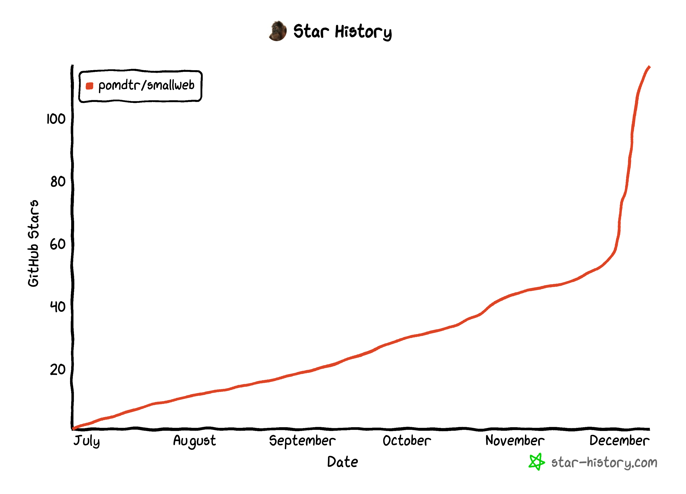
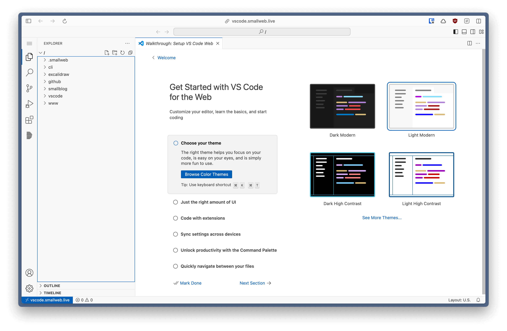

Last week was quite something! Before detailling the changes contained is this release, here is a quick to summary of what happened in the smallweb ecosystem:

The number of stars on the github repo doubled, and a lot of new users joined the [discord server](https://discord.gg/BsgQK42qZe). Welcome to all of you! I'm happy to see that smallweb is gaining traction.

<!-- more -->



There is now a way to test out smallweb without installing it on your machine. Just go to <https://smallweb.live>, and start coding! This an early glimpse of what a smallweb cloud service could look like.



And finally, thanks to [Stavros](https://github.com/steveiliop56), we were able to publish smallweb to the [runtipi](https://runtipi.io) store !


If you're a contributor of [coolify](https://coolify.io), [casaos](https://casaos.io), or [yunohost](https://yunohost.org), I would love to hear from you. I won't publish nor maintain these integrations myself (as I'm not a user of those platforms), but I would be happy to help you do it.

Pfouu, that was a lot of news! Now let's dive into the new features of this release.

## View console logs from the `smallweb` cli

I added back the ability to view console logs from the smallweb logs command.

```sh
smallweb logs --console
```

You can also filter the logs by app using the `--app` flag.

```sh
smallweb logs --console --app myapp
```

## admin rights are now configured from the global config

I moved the admin rights configuration from the app config to the global config. Instead of doing:

```json
// ~/smallweb/myapp/smallweb.json
{
    "admin": true
}
```

You should now do:

```json
// ~/smallweb/.smallweb/config.json
{
    "adminApps": ["myapp"]
}
```

This change was motivated by my work on [smallweb.live](https://smallweb.live). I wanted to prevent users from creating new admin apps. However, this was tricky to do, since any user could potentially create a new folder, put a `smallweb.json` file with the `admin` field set to `true`, and gain admin rights.

Now, I can just make the `~/.smallweb/config.json` file read-only, and prevent any user from creating new admin apps.

## Pretty error pages

From now on, smallweb will display a pretty error page when an error occurs. This page is customizable from the global config.


## Adding additional wildcards domain

While adapting smallweb for [runtipi](https://runtipi.io), we encountered an issue. Runtipi apps can be accessed from multiple domains:

- `<app>.smallweb.tipi.local`
- `<app>.<user-domain>`

In order to support that, I added the ability to map additional wildcards domain to your smallweb instance from the global config.

```json
{
    "domain": "smallweb.tipi.local",
    "customDomains": {
        "<user-domain>": "*", // map <app>.<user-domain> to ~/smallweb/<app>
        "example.com": "example" // map example.com to the example ~/smallweb/example
    }
}
```

In the future, the `customDomains` field will probably be renamed to `additionalDomains`.

## smallweb is now available as a docker image

Smallweb is now available as a docker image at [ghcr.io/pomdtr/smallweb](https://ghcr.io/pomdtr/smallweb). You can run it with:

```sh
docker run -v ~/smallweb:/smallweb -p 7777:7777 ghcr.io/pomdtr/smallweb:latest
```
