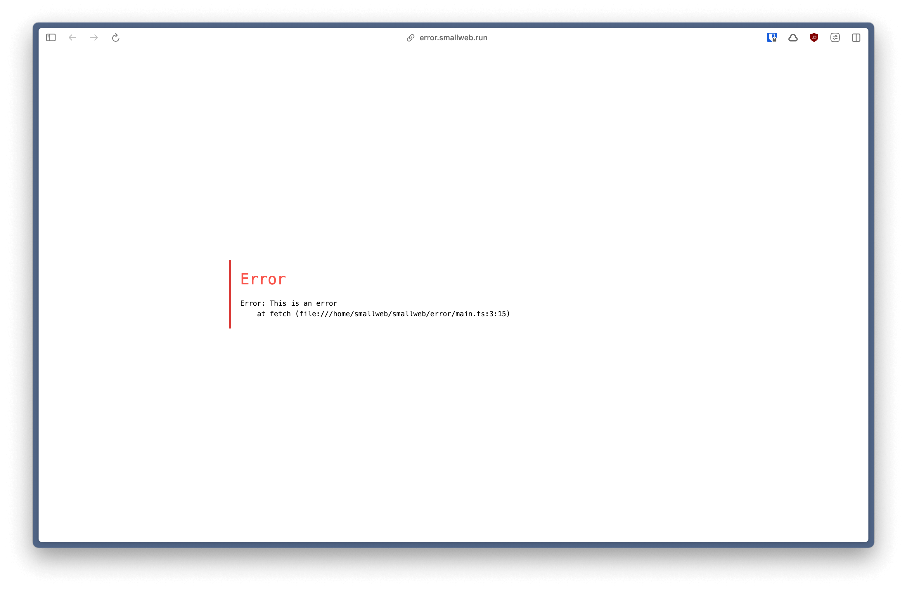

Last week was quite something! The number of stars on the github repo doubled, and a lot of new users joined the [discord server](https://discord.gg/BsgQK42qZe). Welcome to all of you!

<!-- more -->


With the help of [], we were able to publish smallweb to the [runtipi](https://runtipi.io) store !

.

If you're a contributor of [coolify](https://coolify.io), [casaos](https://casaos.io), or [yunohost](https://yunohost.org), I would love to hear from you. I won't publish nor maintain these integrations myself (as I'm not a user of those platforms), but I would be happy to help you do it.

## `smallweb logs --console`

I added back the ability to view console logs from the smallweb logs command. You can also filter the logs by app using the `--app` flag.

```sh
smallweb logs --console --app myapp
```

## admin rights are now configured from the global config

I moved the admin rights configuration from the app config to the global config. Instead of doing:

```json
// ~/smallweb/myapp/smallweb.json
{
    "admin": true
}
```

You should now do:

```json
// ~/smallweb/.smallweb/config.json
{
    "adminApps": ["myapp"]
}
```

This change was motivated by my work on [smallweb.live](https://smallweb.live). I wanted to prevent users from creating new admin apps. However, this was tricky to do, since any user could potentially create a new folder, put a `smallweb.json` file with the `admin` field set to `true`, and gain admin rights.

Now, I can just make the `~/.smallweb/config.json` file read-only, and prevent any user from creating new admin apps.

## Pretty error pages

From now on, smallweb will display a pretty error page when an error occurs. This page is customizable from the global config.



## Mapping additional wildcards domain to your smallweb instance

While adapting smallweb for [runtipi](https://runtipi.io), we encountered an issue. Runtipi apps can be accessed from multiple domains:

- `<app>.smallweb.tipi.local`
- `<app>.<user-domain>`

In order to support that, I added the ability to map additional wildcards domain to your smallweb instance from the global config.

```json
{
    "domain": "smallweb.tipi.local",
    "customDomains": {
        "<user-domain>": "*", // map <app>.<user-domain> to ~/smallweb/<app>
        "example.com": "example" // map example.com to the example ~/smallweb/example
    }
}
```

## Smallweb Docker Image

Smallweb is now available as a docker image at [ghcr.io/pomdtr/smallweb](https://ghcr.io/pomdtr/smallweb). You can run it with:

```sh
docker run -v ~/smallweb:/smallweb -p 7777:7777 ghcr.io/pomdtr/smallweb:latest
```
