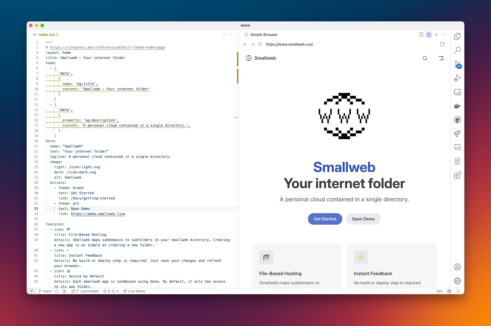

I spent the last week (and probably the next one) working on the `smallweb.live` platform. I'm quite happy with the progress, as the list of alpha testers is steadily growing.

Still, I've made a few changes on the `smallweb` cli, so here is a new release!

<!-- more -->

If you want to join the alpha, either register in the [waitlist](https://cloud.smallweb.run), or reach out to me on [discord](https://discord.smallweb.run). Active users on discord will get priority access!

## opentelemetry support, removal of the `smallweb logs` command

Deno 2.2 introduced support for opentelemetry! I've added a few lines of code to make sure that the `smallweb` cli is compatible with this new feature.

To use opentelemetry, you first need to have an opentelemetry collector setup:

```bash
docker run --name lgtm -p 3000:3000 -p 4317:4317 -p 4318:4318 --rm -ti \
    -v "$PWD"/lgtm/grafana:/data/grafana \
    -v "$PWD"/lgtm/prometheus:/data/prometheus \
    -v "$PWD"/lgtm/loki:/data/loki \
    -e GF_PATHS_DATA=/data/grafana \
    docker.io/grafana/otel-lgtm:0.8.1
```

Then just start smallweb with the `OTEL_DENO` flag:

```bash
OTEL_DENO=true smallweb up
```

Smallweb will use the app domain as the `OTEL_SERVICE_NAME`.

You can find out more info about configuring opentelemetry (and create custom metrics) in the [deno docs](https://docs.deno.com/runtime/fundamentals/open_telemetry/).

You will see the smallweb trace appears in the grafana dashboard!

If you don't want to self-host your own opentelemtry collector, you can create a free account on [grafana cloud](https://grafana.com/products/cloud/). See [their documentation](https://grafana.com/docs/grafana-cloud/send-data/otlp/send-data-otlp/#quickstart-architecture) for more information about how to setup opentelemetry.

As part of this change, I've removed the `smallweb logs` command. I just don't think smallweb should manage its own logs (your console logs will still appears on the stderr when you run `smallweb up`). If you still want your http logs to be saved to a file, I encourage you to setup caddy in front of smallweb, and use the `log` directive. Here is an example of a caddyfile:

```caddy
smallweb.localhost, *.smallweb.localhost {
    reverse_proxy localhost:7777
    log {
        output file /var/log/caddy/smallweb.log
    }
}
```

## updated git remote urls

Instead of using `ssh://<appname>@<domain>`, you should now use `_@<domain>:<appname>.git` (`_` maps to the smallweb cli in smallweb).

The main benefit is that it works better with `git clone` (git clone `_@<domain>:<appname>.git` automatically creates an `<appname>` directory).

If you already had existing remotes setup, just update the url with:

```bash
git remote set-url <remote-name> _@<domain>:<appname>.git
```

You should also remove the existing repos in your `.smallweb/repos/` directory, and they will be automatically recreated on `git push`.

## removal of the `smallweb fetch` command

The smallweb fetch command allowed you to test the fetch entrypoint without having smallweb running. I almost never used it, and I doubt anyone else did. I've removed it to cleanup the codebase.

## new vs code extension

I created a VS Code extension for smallweb ! It still quite rough (currently it only allows you to quickly open an app in the browser), but I plan to add more features in the future.



## deprecation of the `--cron` flag in favour of `--enable-crons`

I just find it more explicit. Both are still supported for the time beeing, but I encourage you to use the new flag.
