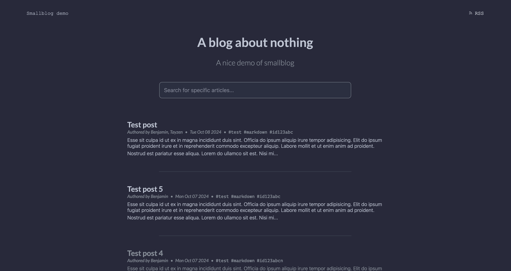
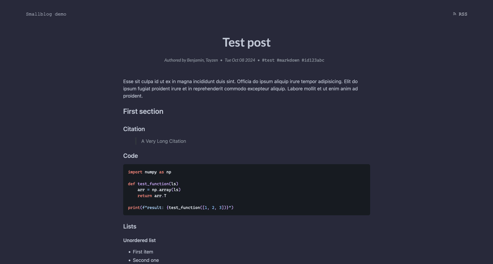

# Smallblog

Smallblog is an easy-to-use blog engine build with [smallweb](https://www.smallweb.run/) in mind.

| Homepage                                   | Blog post                   |
| ------------------------------------------ | --------------------------- |
|  |  |

Smallblog is very efficient to use, you just have to write your article in a Markdown format, and it's directly online. Everything is generated directly by scanning a folder, your blog post is automatically published without any compilation, CI/CD, etc...

It includes all the features you need for a blog (and more):

- Easy syntax to write your articles (no need to edit HTML directly)
- Good SEO (with `robot.txt`, `sitemap.xml`, metadata and good structure)
- Great accessibility
- Quick loading pages
- RSS feed
- Search feature
- Automatic reading time estimation
- It works well without JS

## Demo

A demo is available at this URL: [Smallblog Demo](https://smallblog-demo.tayzen.dev).

## Quickstart

Create a new directory in your smallweb folder, add a `main.tsx` and paste this content in it:

```tsx
import { createSmallblog } from "jsr:@tayzendev/smallblog@0.7.2";

export default createSmallblog({});
```

You're already done! Have fun with your new blog!

## Usage

### Writing an article

When smallblog is correctly installed you just have to write your markdown files in your drafts folder and preview them on the route: `/drafts/your_file_name_without_extension`.

Then, when you finished your writing, you can move the markdown file to the posts' folder (drafts and posts folders can change with the configuration, in this example, they are respectively: `drafts/` and `posts/`).

Smallblog doesn't come with an editor to write blog post. To write this article you can use whatever way you want using the power of smallweb:

- use an editor on another subdomain (vscode or [codejar](https://jsr.io/@pomdtr/smallweb-codejar@0.1.3))
- directly on your server with ssh and a text editor
- with your local vscode connected to the server through SSH
- using [mutagen](https://docs.smallweb.run/hosting/vps.html#syncing-files-using-mutagen)

When you're writing your posts don't forget to write the metadata section, as in this example:

```markdown
---
title: Test post
description: A post to test the markdown rendering
authors:
  - Tayzen
tags:
  - test
date: 2024-10-08
section: Technology
---

This is a text after the metadata.
```

This metadata is displayed to the user, except for the `published` and `section` one, which are used as follows:

- `published`: This property is used by the engine to not display articles whose its value is explicitly set to `false` ([posts/private.md](posts/private.md) is an example)
- `section`: This property is used to give more details to search engines about your article

None of this metadata are required, but I highly recommend you to write them, they will improve your SEO, give useful insights to your users and in the index page the articles are sorted by date (so, no date will break the order of your posts).

### Serving static files

There are two kinds of static files which are handled differently:

1. The favicon: The favicon can be placed anywhere in your blog folder, its path has to be configured in smallblog
2. The static files in your blog posts: They have to be in your drafts or posts folders (or a subfolder) and you can reference them in a relative manner in your markdown files as usual (the preview will work normally in any editors)

In both ways smallblog will serve these files without you have to think about it.

### Integrated CLI

The integrated CLI helps you manipulate your posts. It can create your posts, open them in your editor of choice, publish them and more.

It forces you to have the following workflow: each post should have a companion folder with the same name where you should put the static resources (images, etc...).

In the following example, we suppose that the folder where you app is installed is `blog`. The steps are:

- creating a new post
- opening it in an editor
- listing all the posts
- publishing your new one
- archiving it
- removing it

```sh
smallweb run blog create --title="My new post" --content="Some content" --authors="Tayzen" --authors="Author2" --tags="tag1" --tags="tag2" my_article
# Smallblog has created my_article.md in your drafts folder and a folder where you should put your images.
smallweb run blog edit my_article
# Smallblog open my_article.md in your editor (corresponding to the variable `$EDITOR`).
smallweb run blog list
# Posts:
#
# Published:
#     -  post
#     - post2
#     - post3
#
# Drafts:
#     - my_article
smallweb run blog publish my_article
# Smallblog has moved my_article.md and its companion folder in your posts folder, so it's now pusblished.
smallweb run blog archive my_article
# Smallblog has moved my_article.md and its companion folder in your drafts folder, so it's not public anymore.
smallweb run blog remove my_article
# Smallblog has removed my_article.md and its companion folder (you can only remove a post from the drafts folder, it's a security mechanism).
```

To know more about the commands, you can run `smallweb run blog --help` or `smallweb run blog help [subcommand]`.

### Adding custom scripts

You may want to add custom scripts for analytics purposes (or anything else you may want). For this purpose, there are 2 variables in the configuration of smallblog:

- `customHeaderScript`: The script will be added between the tags `<head></head>`, be careful, because of HTMX boosting, they will only execute with full page refresh.
- `customBodyScript`: The script will be placed at the top of the `<body></body>`, it will be executed at every page change.

I configured [plausible.io](https://plausible.io) in my personal blog. They are asking you to set up their script in the header of the pages, but I only got the tracking working correctly when I moved the script in the body.

## Detailled installation

2 methods of installation are available:

- Import from JSR: If you want the simplest way to use smallblog, this is for you.
- Cloning this repo: If you want to customize the look and feel of your blog.

### Method 1: JSR import

1. In your smallweb folder create a new folder (a.k.a. subdomain).
2. In this folder add a `main.tsx` file
3. Add the import statement: `import { createBlogApp } from ...`
4. Export the result of the imported function with the configuration you want (see the examples below)
5. Enjoy, your blog is already running!

Minimal `main.tsx` to quick-start a project (as shown above):

```tsx
import { createSmallblog } from "jsr:@tayzendev/smallblog@0.7.2";

export default createSmallblog({});
```

A `main.tsx` with more parameters:

```tsx
import { html } from "hono/html";
import { createSmallblog } from "jsr:@tayzendev/smallblog@0.7.2";

const customBodyScript = await html`<script
  defer
  data-domain="smallblog-demo.tayzen.dev"
  src="https://plausible.io/js/script.js"
></script>`;

export default createSmallblog({
  faviconPath: "favicon.ico",
  siteDescription:
    "A blog to demonstrate the capabilities of smallblog, the blog engine build for smallweb",
  siteTitle: "Smallblog demo",
  indexTitle: "A blog about nothing",
  indexSubtitle: "A nice demo of smallblog",
  customBodyScript,
});
```

Please refer to the [documentation](https://jsr.io/@tayzendev/smallblog/doc/~/BlogAppOptions) for more details about the parameters.

### Method 2: Cloning the repo

1. Go to your smallweb folder: `cd /path/to/your/smallweb/folder`
2. Clone the repo with the folder name you want: `git clone https://github.com/TayzenDev/smallblog.git folder_name`
3. Edit the code
4. Enjoy!

To help you edit what you want, this is an overview of the code organization:

- To customize the pages, components and style, you can look into the `pages/` folder
- To look at the "business logic", you can check the file `blog.ts`
- The hono server and blog creation function are located in the `mod.ts` file.

### After installation

If you want your drafts to be private, you can use the smallweb authentication on the `/drafts` route. To do so, you can add a file called `smallweb.json` in your project's folder and copy this configuration:

```json
{
  "privateRoutes": ["/drafts"]
}
```

## Technologies

The list of technologies/libraries used:

- [hono](https://hono.dev/) for the routing
- [deno-gfm](https://deno.land/x/gfm@0.6.0) to render the markdown into blog posts
- [HTMX](https://htmx.org/) to boost the pages (avoiding full page refreshes) and make a "see result as you type" search feature
- [minisearch](https://lucaong.github.io/minisearch/) to do the search feature (which is executed server-side)
- the [RSS node package](https://www.npmjs.com/package/rss) to dynamically create the RSS feed
- a dynamic sitemap generator script heavily inspired by the [deno sitemap package](https://deno.land/x/deno_sitemap@0.1.3)

I made the blog worked even without JS on the client without sacrificing too much on the experience (you just don't have page boosting, and you have to type on enter to search for posts). So, all the features are executed server-side, even the pagination and the search.
