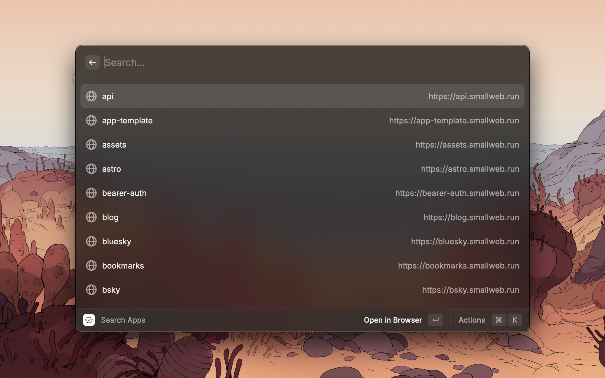
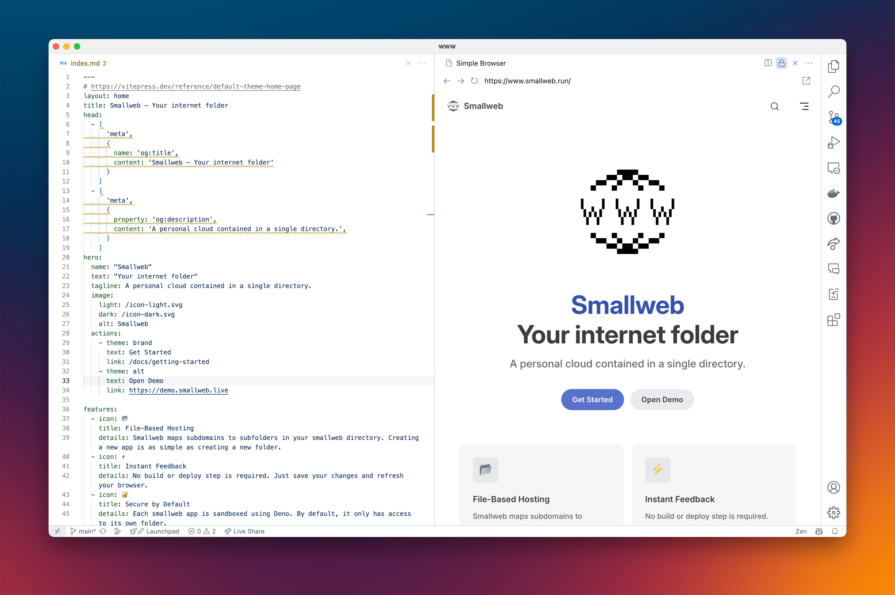

# Integrations

Smallweb can easily be integrated to other tools.

Since the whole state of your smallweb instance is stored in a single directory, it is quite easy to scan it to find the existing apps and domains.

## Raycast

A smallweb extension is available [on the Raycast store](https://www.raycast.com/pomdtr/smallweb).

## VS Code

A smallweb extension is available [on the VS Code marketplace](https://marketplace.visualstudio.com/items?itemName=pomdtr.smallweb).

