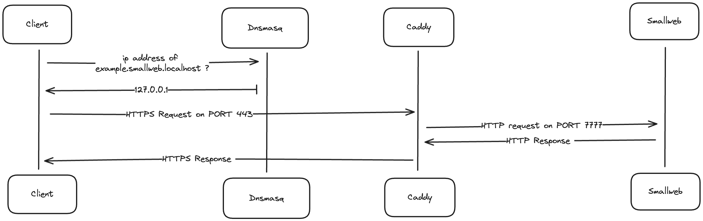

This section will guide you through the process of setting up a local instance of smallweb.

This setup is useful for developing and testing smallweb apps locally, without having to deploy them to the internet.

If you want to expose your apps to the internet instead, you can follow the [Cloudflare Tunnel setup guide](../cloudflare/index.md).

## Architecture

The following diagram illustrates the architecture of the local setup:

The components needed are:

- a dns server to map `localhost` domains to `127.0.0.1` ip address (only needed on macOS)
- a reverse proxy to generate and renew SSL certificates for the domains, and forward requests to the smallweb server
- smallweb itself
