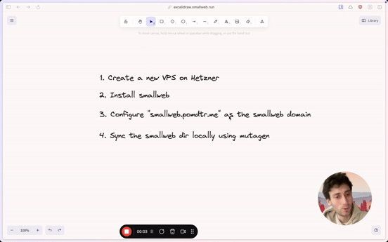

# VPS / Home Server

This page will guide you through the process of hosting smallweb on a VPS. Any VPS provider will work, but if you're looking for a recommendation, I had a good experience with [Hetzner](https://www.hetzner.com/cloud).

If you prefer a video tutorial, just click on the image below.

[](https://videos.smallweb.run/watch/14eb68b3-6433-49e3-8256-c06482533031)

## Installation

To install smallweb on a new VPS, just use the installation script:

```bash
curl -sSL https://install.smallweb.run/vps.sh | sh
```

You'll smallweb instance will be accessible through a [sslip.io](https://sslip.io) domain. No need to configure DNS records to get started!

## Wire your own domain

If your domain is `example.com`, you'll need to set the following DNS records:

- `A` record for `example.com` pointing to your server's IPV4 address.
- `AAAA` record for `example.com` pointing to your server's IPv6 address.
- `A` record for `*.example.com` pointing to your server's IPV4 address.
- `AAAA` record for `*.example.com` pointing to your server's IPv6 address.

Then update the `domain` field from the `.smallweb/config.json` file to `example.com`.

```json
{
    "domain": "example.com"
}
```

## Accessing your smallweb workspace locally

First, install deno, smallweb and mutagen to your local machine. You can do this using Homebrew.

```bash
brew install deno
brew install pomdtr/tap/smallweb
brew install mutagen-io/mutagen/mutagen
```

Then, make sure mutagen is running by running the following command.

```bash
mutagen daemon start

# optional: start the mutagen daemon on boot
mutagen daemon register
```

Finally, run the following command to sync your smallweb directory to your local machine.

```bash
smallweb --dir ~/smallweb sync <remote> /home/smallweb/smallweb
```

You should now be able to edit your smallweb workspace from `~/smallweb` on your local machine.
